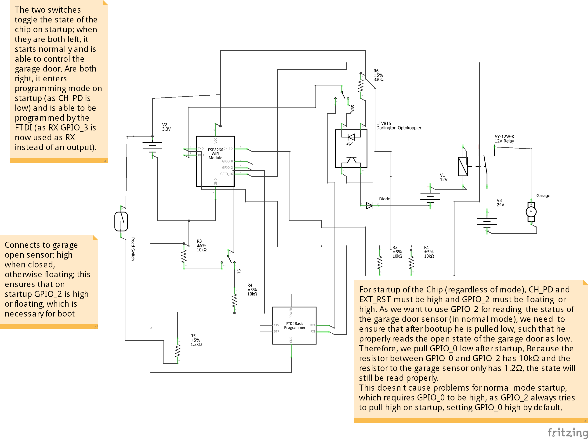

# Garagentorsteuerung-ESP-01
A basic sketch which utilizes an ESP-01 (or similar) to host a website in a local network for the purpose of remotely controlling a garage door (for example via phone).
Code written in [Arduino IDE](https://github.com/arduino/Arduino), the hardware sketch made with [Fritzing](https://github.com/fritzing/fritzing-app).

### Hardware Sketch

